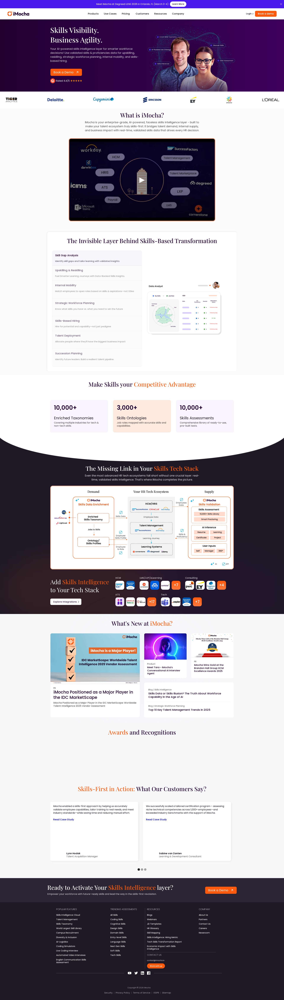

# iMocha Website QA Audit Report

**Date:** 28/2/2026, 4:34:12 pm  
**URL:** http://localhost:8888  
**Auditor:** Browser Automation Agent (QA Role)

---

## 📊 Summary

| Metric | Value |
|--------|-------|
| Total Tests | 10 |
| ✅ Passed | 7 |
| ❌ Failed | 1 |
| ⚠️ Warnings | 1 |
| **Success Rate** | **70%** |

---

## 🧪 Test Results

### Navigation Tests
- ✅ **Navigation**: Navigation bar element found
- ℹ️ **Navigation**: Found 0 navigation menu items: ...
- ✅ **Branding**: Logo element found
- ✅ **Links**: AI-SkillsMatchMatch talent to : HTTP 200
- ✅ **Links**: Conversational AI Interviewer : HTTP 200
- ✅ **Links**: Skills Assessment​Validate can: HTTP 200

### Layout Tests
- ❌ **Layout**: Hero section NOT found
- ✅ **Layout**: Footer found

### Mobile Tests
- ✅ **Mobile**: Mobile menu button found

### JavaScript Tests
- ⚠️ **JavaScript**: Found 1 console errors

---

## 📸 Screenshots

### Desktop View (1920x1080)

### Mobile View (iPhone 14 Pro)

### Dark Mode

---

## 💡 Recommendations

- Fix all FAILED items before deployment
- Review failed navigation elements
- Test in multiple browsers
- Review WARNING items for potential issues
- Monitor console errors in production
- Regular testing across different viewports
- Performance testing with larger content

---

## 🎯 QA Certificate

❌ **FAILED** - 1 critical issues found

---

*Report generated by Browser Automation Agent*  
*Powered by Playwright*
